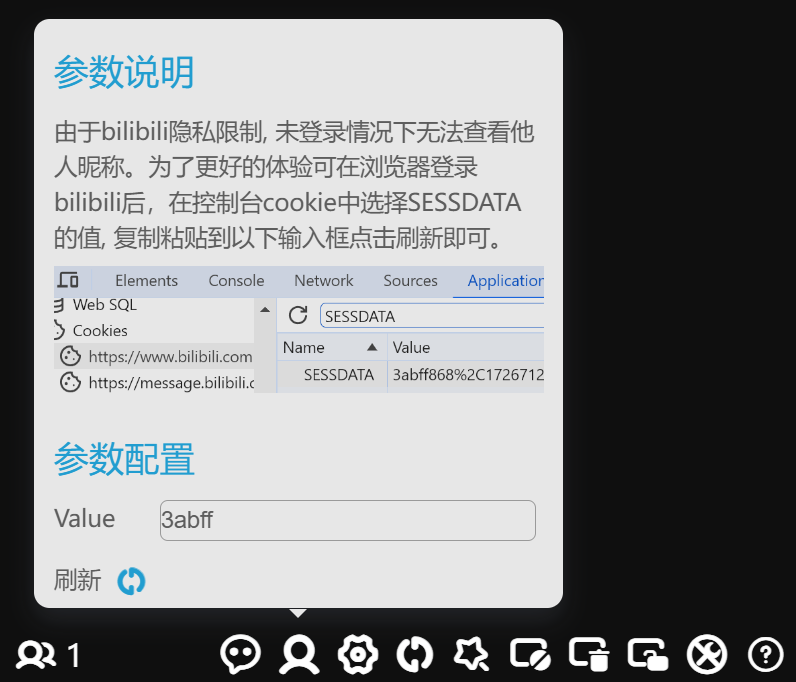

# bilive-danmaku

<div align="center">


<br>
一个开源的 bilibili 直播弹幕姬，支持 win 和 mac
<br>

</div>

### 预览


[视频预览](https://www.bilibili.com/video/av328551804)

### 使用

[下载 Release](https://github.com/Beats0/bilive-danmaku/releases)

输入房间号 RoomID 后，回车提交即可连接

### 功能

面板和官方 web 端几乎一模一样，主要拓展了订阅列表，~~弹幕翻译~~，语音朗读，多语言配置等功能

支持的消息类型

```
LIVE                // 开播消息
POPULAR             // 人气
WATCHED_CHANGE      // 直播间看过人数
DANMU_MSG           // 弹幕消息
SEND_GIFT           // 礼物消息
SPECIAL_GIFT        // TODO
COMBO_SEND          // 礼物连击消息
COMBO_END           // TODO 礼物连击结束消息
NOTICE_MSG          // 广播消息
WELCOME             // 欢迎进入直播间（不会触发）
WELCOME_GUARD       // 欢迎舰长进入直播间（不会触发）
ENTRY_EFFECT        // 舰长、高能榜、老爷进入直播间
INTERACT_WORD       // 用户进入直播间，用户关注直播间
ROOM_BLOCK_MSG      // 用户被禁言
GUARD_BUY           // 上舰消息
SUPER_CHAT_MESSAGE  // SC消息
WARNING             // 直播警告消息
CUT_OFF             // 直播强制切断消息
```

### 注意 Note!

1. 登录认证(可选)

由于 bilibili 隐私限制, 未登录情况下无法查看他人昵称。为了更好的体验可在浏览器登录 bilibili 后，在控制台 cookie 中选择 SESSDATA 的值, 复制粘贴到以下输入框点击刷新即可。



2. ~~翻译~~和朗读(翻译已失效)

~~大量使用 google translate api，超出官方调用频率会导致请求超时，翻译或朗读失败。~~

3. 鼠标穿透功能

点击顶部穿透按钮后可开启鼠标穿透功能，再次点击可取消解锁

4. 自定义样式(仅支持昵称样式和弹幕样式)

点击 Dev Tools，编写对应的编辑 CSS 样式，只复制 css 声明语句，例如上图的 css 为

```css
text-shadow: 1px 1px 2px #e91e63, 0 0 0.2em #e91e63;
```

填入到 `设置` > `自定义样式` 中，`Ctrl+R` 重载即可。

### 开发

[README_DEV](https://github.com/Beats0/bilive-danmaku/blob/master/README_DEV.md)

### [更新日志](https://github.com/Beats0/bilive-danmaku/blob/master/CHANGELOG.md)

### LICENSE

[MIT](https://github.com/Beats0/bilive-danmaku/blob/master/LICENSE)

[MIT © Electron React Boilerplate](https://github.com/electron-react-boilerplate/electron-react-boilerplate)
